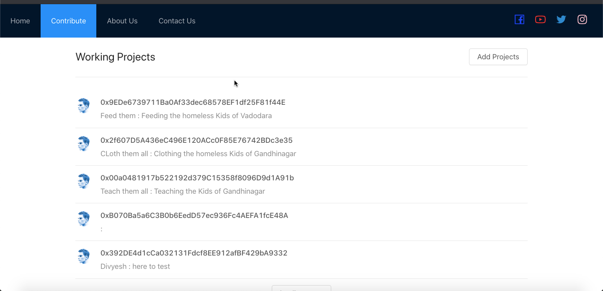
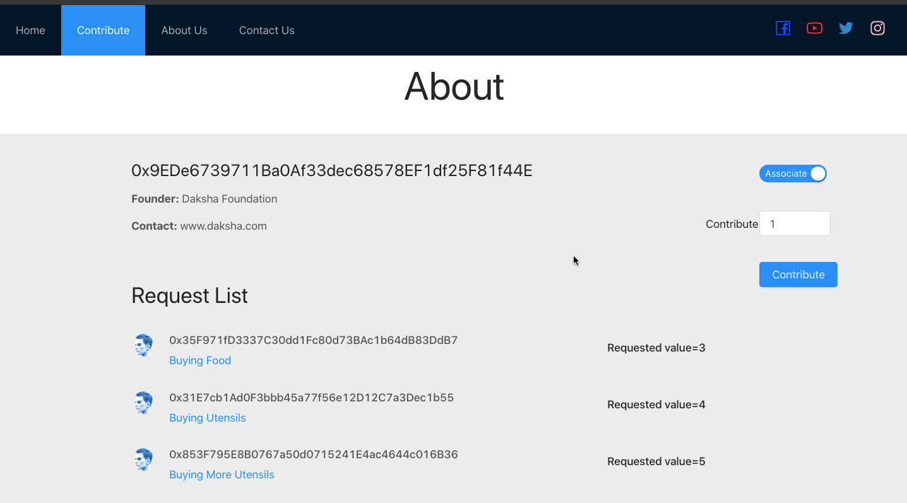
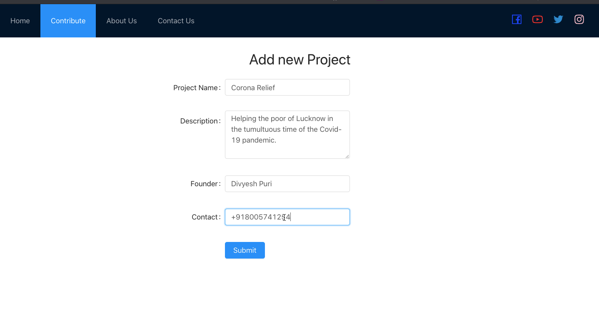

# Sahara
A transparent platform for supporting the less fortunate.

### About
An Ethereum based Decentralised CrowdFunding appication for Non-Profits and Charitable Organisations. The Dapp maintains a consensus while spending the collected Ether.







### Development

-   Install Dependencies.

```sh
npm install
```

-   To run the Dapp.

```sh
cd app
npm start
```
---

### Technologies Used

##### Back End

-   [Node](https://nodejs.org)
-   [Ethereum](https://www.ethereum.org/)
-   [Solidity](https://solidity.readthedocs.io/en/v0.5.12/)
-   [Web3](https://web3js.readthedocs.io/en/v1.2.2/)

##### Front End

-   [React](https://reactjs.org)

---

### Contributing

See [CONTRIBUTING.md](CONTRIBUTING.md).

---

### Team Members

-   [Dipansh Khandelwal](https://github.com/DipanshKhandelwal)
-   [Divyesh Puri](https://github.com/DivyeshPuri)
-   [Rohan Dhoot](https://github.com/rohan2599)
-   and [Myself](https://github.com/amany9000)

---

Found a bug? Create an [issue](https://github.com/amany9000/Sahara/issues).